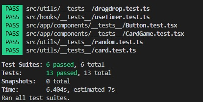

# Zoovu's Game

This project was created as the final result of Zoovu's challenges.
> _Hi, I am Gerson Toribio_ and I followed these steps to develop the game

- I created this project showing my knowledge in React. I used `create-react-app` with a library `react-app-rewired` to modify the basic configuration of `create-react-app` project.

- I created a store to handle the state management using `context` from react and `mobx` to read and modify from the store.

- I added a custom hook `useTimer` to handle the timeup and the behaviour inside the game.

- I used `react-router-dom` to navigate inside the game and added a private view for the **Game View**

- I used `jest` and `enzyme` for basic unit tests.

- For drag and drop events, I used a library `react-beautiful-dnd`.

- For styles, I used `emtion` because it compiles faster than use `css` files.

And this is the final result.


> Note: I added some aditional animations or messages to the app.

## Run the project

If you want to run the project, just run:

```
npm run start
```
and you are going to be able to play in your http://localhost:3000, this is the URL by default.

## How to test the project
Run the following command
```
npm run test
```
and you are going to get the following response in your terminal



